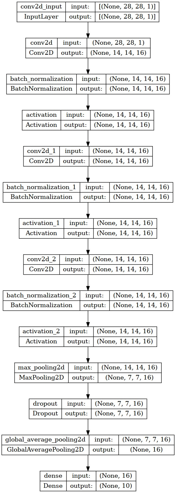

# PSoC&trade; 4: AI-based Written Digits Recognition

This demo showcases the execution of a neural network able to detect digits from 0 to 9 written with a finger on the CAPSENSE&trade; Touchpad using PSoC&trade; 4.


## Requirements

- [ModusToolbox software](https://www.infineon.com/modustoolbox) v3.0 or later (tested with v3.0)

  **Note:** This code example version requires ModusToolbox&trade; software version 3.0 or later and is not backward compatible with v2.4 or older versions.

- Board support package (BSP) minimum required version: 3.0.0
- Programming language: C/C++
- Associated parts: [PSoC 4100S Max](https://www.infineon.com/cms/en/product/microcontroller/32-bit-psoc-arm-cortex-microcontroller/psoc-4-32-bit-arm-cortex-m0-mcu/)

## Supported toolchains (make variable 'TOOLCHAIN')

- GNU Arm&reg; embedded compiler v10.3.1 (`GCC_ARM`) - Default value of `TOOLCHAIN`
- Arm&reg; compiler v6.16 (`ARM`)
- IAR C/C++ compiler v9.30.1 (`IAR`)

## Supported kits (make variable 'TARGET')

- [PSoC 4100S Max pioneer kit](https://www.infineon.com/CY8CKIT-041S-MAX) (`CY8CKIT-041S-MAX`) - Default value of `TARGET`


## Hardware setup

Connect the PSoCPSoC&trade; 4 SMAX board to the CAPSENSE&trade; sensing expansion board by using the ribbon cable included in the package. Use the 40-pin connector on the CAPSENSE&trade; sensing expansion board called "TOUCHPAD FLEX CONNECTOR" as shown in figure:


**Note:** The PSoC&trade; 4 kits ship with KitProg2 installed. The ModusToolbox&trade; software requires KitProg3. Before using this code example, make sure that the board is upgraded to KitProg3. The tool and instructions are available in the [Firmware Loader](https://github.com/Infineon/Firmware-loader) GitHub repository. If you do not upgrade, you will see an error like "unable to find CMSIS-DAP device" or "KitProg firmware is out of date".

## Software setup

Paste the folder "Written-Digist-Recognition-PSoC4" in you ModusToolbox&trade; workspace.

This demo application uses a GUI to show the drawing in real time and to plot the neural network's inference results. The GUI needs to be configured to listen to the correct serial port. To perform the configuration, navigate to Written-Digits-Recognition-PSoC4/GUI and open "serial.conf" file. Edit it according to the serial port assigned to your kit on your PC. Save the file.

```
[SERIAL]
port = COM5

```

This example requires no additional software or tools.

## Importing the code example

Import the project in ModusToolbox&trade; by following the steps below:

<details><summary><b>In Eclipse IDE for ModusToolbox&trade; software</b></summary>

1. Click the **Import Existing Application In-Place** link in the **Quick Panel** (or, use **File** > **New** > **ModusToolbox&trade; Application**).

2. Select the "Written-Digits-Recognition-PSoC4" folder in your workspace from the **Import ModusToolbox Project** dialog.

3. Click **Finish** and wait for the application import process to complete.

4. In the ModusToolbox&trade; console, run the command `make getlibs` and wait for the execution to be completed.

For more details, see the [Eclipse IDE for ModusToolbox&trade; software user guide](https://www.infineon.com/MTBEclipseIDEUserGuide) (locally available at *{ModusToolbox&trade; software install directory}/docs_{version}/mt_ide_user_guide.pdf*).


## Operation

1. Connect the board to your PC using the provided USB cable through the KitProg3 USB connector.

2. Program the board using one of the following:

   <details><summary><b>Using Eclipse IDE for ModusToolbox&trade; software</b></summary>

      1. Select the application project in the Project Explorer.

      2. In the **Quick Panel**, scroll down, and click **\<Application Name> Program (KitProg3_MiniProg4)**.

   </details>

   <details><summary><b>Using CLI</b></summary>

     From the terminal, execute the `make program` command to build and program the application using the default toolchain to the default target. The default toolchain is specified in the application's Makefile but you can override this value manually:
      ```
      make program TOOLCHAIN=<toolchain>
      ```

      Example:
      ```
      make program TOOLCHAIN=GCC_ARM
      ```
   </details>


3. After programming, the application starts automatically. Navigate to the folder `Written-Digits-Recognition-PSoC4/GUI` and run the **realtime-gui.exe** program by double-clicking it. A terminal window will open and after 10 seconds, the GUI will be displayed.

   **Figure 1. GUI displayed.**

   

4. By keeping the kit oriented vertically, with the USB connector on the upper side and the CAPSENSE&trade; shield near you, use your finger to write a single digit from 0 to 9 on the CAPSENSE&trade; touchpad.
Write the number by trying to exploit the full surface of the shield as shown in the following image:

   **Figure 2. Correct drawing orientation.**
   

   You will see the GUI showing your drawing in real time on the `Raw CAPSENSE Output` window: 

   **Figure 3. Real-time drawing being shown.**
   

   When your drawing is complete, simply lift your finger from the touchpad.

5. The neural network will be triggered after 1 second without touch activity. Raw input will be preprocessed and fed into the neural network. The execution will return the confidence value for each digit, and the highest one will be selected as predicted digit:

   **Figure 4. Neural network inference results displayed.**
   

6. Repeat steps 4 and 5 with different digits. The system can tolerate rotations and rescaling of the written digits up to a certain amount. Highest accuracy is obtained when digits are written by exploiting the full surface and keeping the orientation of the board as described above.


## Debugging

You can debug the example to step through the code. In the IDE, use the **\<Application Name> Debug (KitProg3_MiniProg4)** configuration in the **Quick Panel**. For details, see the "Program and debug" section in the [Eclipse IDE for ModusToolbox&trade; software user guide](https://www.infineon.com/MTBEclipseIDEUserGuide).

## Design and implementation

The example is composed by three core components:

1. Firmware responsible for capturing CAPSENSE input and preprocessing
2. TensorFlow Lite Micro library compiled for PSoC4
3. Neural network for performing digits classification


### Firmware block scheme

The firmware has been designed according to the following block scheme. A .pdf file is provided in the  `doc` folder.


The main loop of the application keeps waiting for input data to be ready. If no data is available yet, the CAPSENSE scan loop is executed, where the touchpad waits until a finger is detected. When a finger is detected for the first time, touch coordinates are read and saved in an optimized data structure to keep track of the drawing. When the finger is lift, a timer counts until one second of time is elapsed. If the user keeps drawing, the timer is stopped and will be resumed when the finger will be lift again. Once the timer expires, the "acquired_data" flag is set to True to indicate that the user has finished the drawing. The data is then preprocessed (it is downscaled to match the expected input size for the neural network), and the "data_ready" flag is set to True. 

When the main loop detects the "data_ready" flag to be true, the neural network is called to perform inference on the data. Flags are resetted to prepare for another acquisition.


### TFLM Library porting

To achieve the execution of neural networks on PSoC4, a manual porting of the TensorFlow Lite Micro library has been performed. The library source code is contained in the  `tflm-cmsis` folder. It can be ported on another PSoC4 equipped board by taking care of including the compiler flags set on the Makefile, since they are required for the correct compilation.

### Neural network design

The neural network has been designed specifically by taking into account the constraints of the target device, by applying Tiny-ML oriented design techniques. The optimal architecture has been chosen among differet models of increasing complexity trained on the [MNIST public dataset](https://en.wikipedia.org/wiki/MNIST_database). The model is a standard Convolutional Neural Network with the following architecture:



The model has a total of 5114 parameters.

After training the neural network on the MNIST dataset, a fine-tuning of the model has been performed on a custom dataset collected directly from the CAPSENSE&trade; touchpad.
Fine-tuning training ended with the following loss and accuracy values:

```
Epoch 456/1000
25/25 - 0s - loss: 0.0772 - accuracy: 0.9800 - val_loss: 0.0341 - val_accuracy: 0.9900 - 168ms/epoch - 7ms/step
```

And a testing on a portion of data collected from CAPSENSE&trade; shield showed perfect classification:

```
4/4 [==============================] - 0s 7ms/step - loss: 0.0225 - accuracy: 1.0000

Test accuracy: 100.0%
```

The model has been quantized at 8-bit depth to reduce its size and exported in .cc by using TensorFlow Lite Micro.
The final model requires 5KB of Flash memory to be stored. 

<br>

## Related resources

Resources  | Links
-----------|----------------------------------
Application notes  | [AN79953](https://www.infineon.com/AN79953) – Getting started with PSoC&trade; 4
Code examples  | [Using ModusToolbox&trade; software](https://github.com/Infineon/Code-Examples-for-ModusToolbox-Software) on GitHub <br> [Using PSoC&trade; Creator](https://www.infineon.com/cms/en/design-support/software/code-examples/psoc-3-4-5-code-examples-for-psoc-creator/)
Device documentation | [PSoC&trade; 4 datasheets](https://www.infineon.com/cms/en/search.html#!view=downloads&term=psoc4&doc_group=Data%20Sheet) <br>[PSoC&trade; 4 technical reference manuals](https://www.infineon.com/cms/en/search.html#!view=downloads&term=psoc4&doc_group=Additional%20Technical%20Information)
Development kits | Select your kits from the [Evaluation Board Finder](https://www.infineon.com/cms/en/design-support/finder-selection-tools/product-finder/evaluation-board) page.
Libraries on GitHub | [mtb-pdl-cat2](https://github.com/Infineon/mtb-pdl-cat2) – PSoC&trade; 4 peripheral driver library (PDL)<br> [mtb-hal-cat2](https://github.com/Infineon/mtb-hal-cat2) – Hardware abstraction layer (HAL) library
Middleware on GitHub | [capsense](https://github.com/Infineon/capsense) – CAPSENSE&trade; library and documents <br>
Tools  | [ModusToolbox&trade; software](https://www.infineon.com/modustoolbox) – ModusToolbox&trade; software is a collection of easy-to-use software and tools enabling rapid development with Infineon MCUs, covering applications from embedded sense and control to wireless and cloud-connected systems using AIROC&trade; Wi-Fi and Bluetooth® connectivity devices. <br /> [PSoC&trade; Creator](https://www.infineon.com/cms/en/design-support/tools/sdk/psoc-software/psoc-creator/) – IDE for PSoC&trade; and FM0+ MCU development

<br />


## Other resources

Infineon provides a wealth of data at www.infineon.com to help you select the right device, and quickly and effectively integrate it into your design.

## Document history

Document title: *CE230635* - *PSoC&trade; 4: Hello world*

 Version | Description of change
 ------- | ---------------------
 1.0.0   | New code example
 1.1.0   | Added support for new kits
 2.0.0   | Major update to support ModusToolbox&trade; v3.0. <br> This version is not backward compatible with previous versions of ModusToolbox&trade; software.

<br />

---------------------------------------------------------

© Cypress Semiconductor Corporation, 2020-2022. This document is the property of Cypress Semiconductor Corporation, an Infineon Technologies company, and its affiliates ("Cypress").  This document, including any software or firmware included or referenced in this document ("Software"), is owned by Cypress under the intellectual property laws and treaties of the United States and other countries worldwide.  Cypress reserves all rights under such laws and treaties and does not, except as specifically stated in this paragraph, grant any license under its patents, copyrights, trademarks, or other intellectual property rights.  If the Software is not accompanied by a license agreement and you do not otherwise have a written agreement with Cypress governing the use of the Software, then Cypress hereby grants you a personal, non-exclusive, nontransferable license (without the right to sublicense) (1) under its copyright rights in the Software (a) for Software provided in source code form, to modify and reproduce the Software solely for use with Cypress hardware products, only internally within your organization, and (b) to distribute the Software in binary code form externally to end users (either directly or indirectly through resellers and distributors), solely for use on Cypress hardware product units, and (2) under those claims of Cypress’s patents that are infringed by the Software (as provided by Cypress, unmodified) to make, use, distribute, and import the Software solely for use with Cypress hardware products.  Any other use, reproduction, modification, translation, or compilation of the Software is prohibited.
<br />
TO THE EXTENT PERMITTED BY APPLICABLE LAW, CYPRESS MAKES NO WARRANTY OF ANY KIND, EXPRESS OR IMPLIED, WITH REGARD TO THIS DOCUMENT OR ANY SOFTWARE OR ACCOMPANYING HARDWARE, INCLUDING, BUT NOT LIMITED TO, THE IMPLIED WARRANTIES OF MERCHANTABILITY AND FITNESS FOR A PARTICULAR PURPOSE.  No computing device can be absolutely secure.  Therefore, despite security measures implemented in Cypress hardware or software products, Cypress shall have no liability arising out of any security breach, such as unauthorized access to or use of a Cypress product. CYPRESS DOES NOT REPRESENT, WARRANT, OR GUARANTEE THAT CYPRESS PRODUCTS, OR SYSTEMS CREATED USING CYPRESS PRODUCTS, WILL BE FREE FROM CORRUPTION, ATTACK, VIRUSES, INTERFERENCE, HACKING, DATA LOSS OR THEFT, OR OTHER SECURITY INTRUSION (collectively, "Security Breach").  Cypress disclaims any liability relating to any Security Breach, and you shall and hereby do release Cypress from any claim, damage, or other liability arising from any Security Breach.  In addition, the products described in these materials may contain design defects or errors known as errata which may cause the product to deviate from published specifications. To the extent permitted by applicable law, Cypress reserves the right to make changes to this document without further notice. Cypress does not assume any liability arising out of the application or use of any product or circuit described in this document. Any information provided in this document, including any sample design information or programming code, is provided only for reference purposes.  It is the responsibility of the user of this document to properly design, program, and test the functionality and safety of any application made of this information and any resulting product.  "High-Risk Device" means any device or system whose failure could cause personal injury, death, or property damage.  Examples of High-Risk Devices are weapons, nuclear installations, surgical implants, and other medical devices.  "Critical Component" means any component of a High-Risk Device whose failure to perform can be reasonably expected to cause, directly or indirectly, the failure of the High-Risk Device, or to affect its safety or effectiveness.  Cypress is not liable, in whole or in part, and you shall and hereby do release Cypress from any claim, damage, or other liability arising from any use of a Cypress product as a Critical Component in a High-Risk Device. You shall indemnify and hold Cypress, including its affiliates, and its directors, officers, employees, agents, distributors, and assigns harmless from and against all claims, costs, damages, and expenses, arising out of any claim, including claims for product liability, personal injury or death, or property damage arising from any use of a Cypress product as a Critical Component in a High-Risk Device. Cypress products are not intended or authorized for use as a Critical Component in any High-Risk Device except to the limited extent that (i) Cypress’s published data sheet for the product explicitly states Cypress has qualified the product for use in a specific High-Risk Device, or (ii) Cypress has given you advance written authorization to use the product as a Critical Component in the specific High-Risk Device and you have signed a separate indemnification agreement.
<br />
Cypress, the Cypress logo, and combinations thereof, WICED, ModusToolbox, PSoC, CapSense, EZ-USB, F-RAM, and Traveo are trademarks or registered trademarks of Cypress or a subsidiary of Cypress in the United States or in other countries. For a more complete list of Cypress trademarks, visit cypress.com. Other names and brands may be claimed as property of their respective owners.
